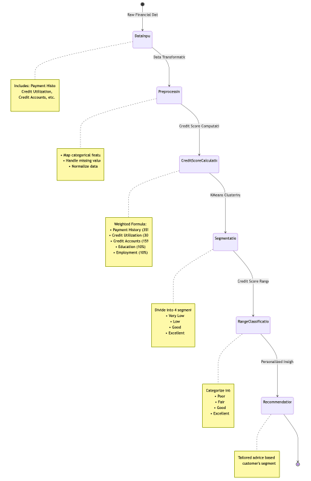
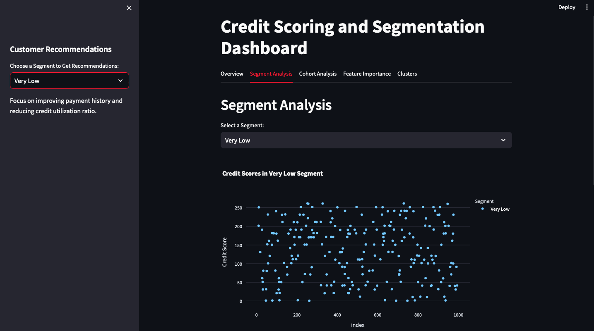

# Credit Scoring and Segmentation Dashboard

This project leverages machine learning techniques and Streamlit to build an interactive dashboard for credit scoring and segmentation. It incorporates credit score calculations, clustering, cohort analysis, and feature importance visualizations.

---

## Features

- **Overview**: Displays a summary of the dataset.
- **Segment Analysis**: Analyze credit score distribution across different customer segments.
- **Cohort Analysis**: Track credit score cohorts over different time periods.
- **Feature Importance**: Understand which factors contribute most to credit scores using a Random Forest model.
- **Clusters**: Visualize customer clusters in a 2D space using PCA.
- **Customer Recommendations**: Provides actionable insights based on customer segments.

---

## Workflow Overview

The dashboard transforms raw financial data through a systematic pipeline: data preprocessing → credit score calculation → customer segmentation → machine learning analysis → personalized insights. Each stage enriches the data, turning complex financial information into clear, actionable recommendations.



## Dashboard Screenshot



---

## Installation

1. Clone the repository:
   ```bash
   git clone https://github.com/your-repo/credit-scoring-dashboard.git
   ```
2. Navigate to the project directory:
   ```bash
   cd credit-scoring-dashboard
   ```
3. Install the required dependencies:
   ```bash
   pip install -r requirements.txt
   ```
4. Run the application:
   ```bash
   streamlit run app.py
   ```

---

